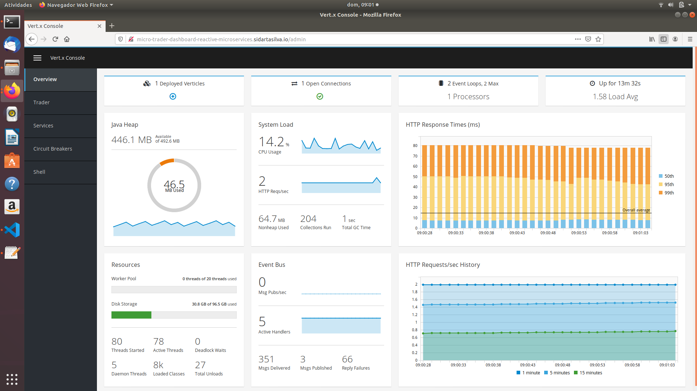
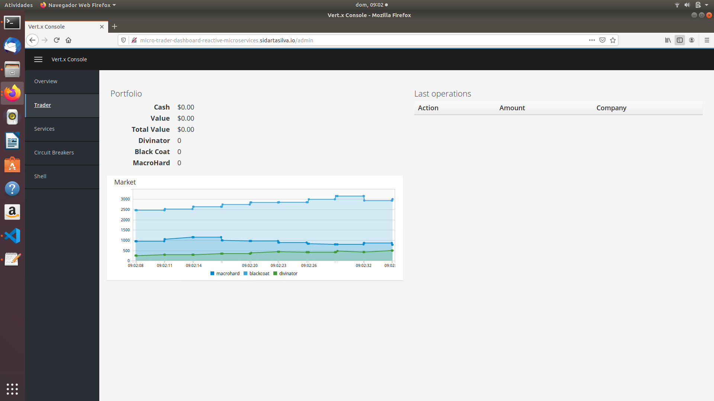

# Building Reactive Microservice Systems

This project is based mainly on the references below.

    <http://escoffier.me/vertx-kubernetes/>

    <https://github.com/yunyu/vertx-console>
    
    ESCOFFIER, C. Building Reactive Microservices in Java Asynchronous and Event-Based Application Design. First Edition. California: O’Reilly Media, Inc., 2017.

    RedHat Developer, accessed 1 November 2019, <https://developers.redhat.com/promotions/building-reactive-microservices-in-java>

    Kubernetes Hands-On - Deploy Microservices to the AWS Cloud 2018, Udemy, accessed 1 November 2019, <https://www.udemy.com/course/kubernetes-microservices>

    <https://github.com/hazelcast/hazelcast-code-samples/>

    <https://vertx.io/docs/vertx-hazelcast>

## The Micro-Trader Application

## Micro-Trader Dashboard

The quote generator simulates the evolution of the values of 3 companies. Every quote is sent on the event bus. It also exposes a Http endpoint to retrieve the last quote of each company.

### Task - Deploying the dashboard

We also need to deploy the dashboard. In the browser, let's enter the associated Ingress route: http://micro-trader-dashboard-reactive-microservices.sidartasilva.io. By appending "/admin", we should see the dashboard in the Vert.x Console.

If we go to the Trader tab, the graph should display the evolution of the market.

